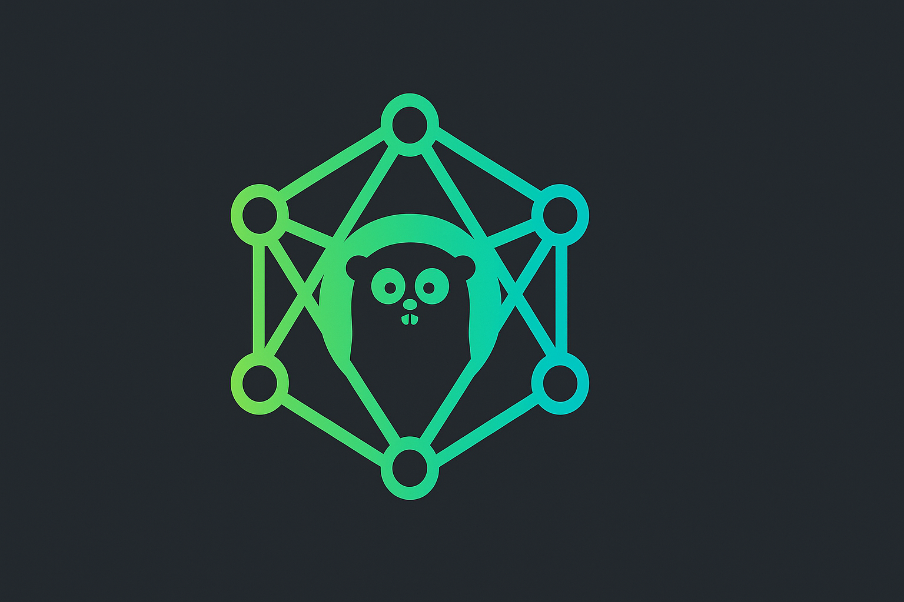

<p align="center">
  <picture>
  <source media="(prefers-color-scheme: dark)" srcset="docs/logo-dark.png" height="300">
  <source media="(prefers-color-scheme: light)" srcset="docs/logo-light.png" height="300">
  
</picture>

  <h1 align="center">go-foundationmodels</h1>
  <h4><p align="center">🚀 Pure Go wrapper for Apple's Foundation Models
</p></h4>
  <p align="center">
    <a href="https://github.com/blacktop/go-foundationmodels/actions" alt="Actions">
          </a>
    <a href="https://github.com/blacktop/go-foundationmodels/releases/latest" alt="Downloads">
          </a>
    <a href="https://github.com/blacktop/go-foundationmodels/releases" alt="GitHub Release">
          </a>
    <a href="http://doge.mit-license.org" alt="LICENSE">
          </a>
</p>
<br>

## Why? 🤔

Apple's Foundation Models provides powerful on-device AI capabilities in macOS 26 Tahoe, but it's only accessible through Swift/Objective-C APIs. This package bridges that gap, offering:

- **🔒 Privacy-focused**: All AI processing happens on-device, no data leaves your Mac
- **⚡ High performance**: Optimized for Apple Silicon with no network latency
- **🛠️ Rich tooling**: Advanced features like input validation, context cancellation, and generation control
- **📦 Self-contained**: Embedded Swift shim library - no external dependencies
- **🎯 Production-ready**: Comprehensive error handling, memory management, and validation

## Features

### Generation Control
- **Temperature control**: Deterministic (0.0) to creative (1.0) output
- **Token limiting**: Control response length with max tokens
- **Helper functions**: `WithDeterministic()`, `WithCreative()`, `WithBalanced()`

### Advanced Tool System ⚠️ **(BETA)**
- **Custom tool creation**: Define tools that AI can call
- **Input validation**: Type checking, required fields, enum constraints, regex patterns
- **Automatic error handling**: Comprehensive validation before execution

> [!WARNING]
> Tool calling is currently not working reliably - under active development

### Context Management
- **Timeout support**: Cancel long-running requests automatically
- **Manual cancellation**: User-controlled request cancellation
- **Context tracking**: 4096-token window with usage monitoring
- **Session refresh**: Seamless context window management

### Robust Architecture
- **Pure Go implementation**: No CGO dependencies, uses purego for Swift bridge
- **Memory safety**: Automatic C string cleanup and proper resource management
- **Error resilience**: Graceful initialization failure handling
- **Self-contained**: Embedded Swift shim library with automatic extraction

## Requirements

* **macOS 26 Tahoe** (beta) or later
* **Apple Intelligence enabled** on your device
* **Apple Silicon Mac** (M1/M2/M3/M4 series)
* **Go 1.24+** (uses latest Go features)
* **Xcode 15.x or later** (for Swift shim compilation if needed)

## Getting Started

```bash
go get github.com/blacktop/go-foundationmodels
```

```go
package main

import (
    "fmt"
    "log"
    fm "github.com/blacktop/go-foundationmodels"
)

func main() {
    // Check availability
    if fm.CheckModelAvailability() != fm.ModelAvailable {
        log.Fatal("Foundation Models not available")
    }

    // Create session
    sess := fm.NewSession()
    defer sess.Release()

    // Generate text
    response := sess.Respond("What is artificial intelligence?", nil)
    fmt.Println(response)

    // Use generation options
    creative := sess.Respond("Write a story", fm.WithCreative())
    fmt.Println(creative)
}
```

## CLI tool `found`

Install with Go:

```bash
go install github.com/blacktop/go-foundationmodels/cmd/found@latest
```

Or download from the latest [release](https://github.com/blacktop/go-foundationmodels/releases/latest)

### CLI Usage

Use `found --help` or `found [command] --help` to see all available commands and examples.

**Available commands:**
- `found info` - Display model availability and system information
- `found quest` - Interactive chat with optional system instructions and JSON output
- `found tool calc` - Mathematical calculations (⚠️ BETA - may not work reliably)
- `found tool weather` - Weather information with geocoding (⚠️ BETA - may not work reliably)


## Known Issues

- **⚠️ Tool calling is currently not working reliably**: While the API and validation infrastructure is complete, Foundation Models may not actually invoke registered tools. This is under active development.

## Roadmap

- [ ] **Fix tool calling reliability** - Primary focus for next release
- [ ] **Streaming responses** with async/await support
- [ ] **Advanced tool schemas** with OpenAPI-style definitions
- [ ] **Multi-modal support** (images, audio) when available
- [ ] **Performance optimizations** for large contexts
- [ ] **Enhanced error handling** with detailed diagnostics
- [ ] **Plugin system** for extensible tool management

## License

MIT Copyright (c) 2025 **blacktop**
